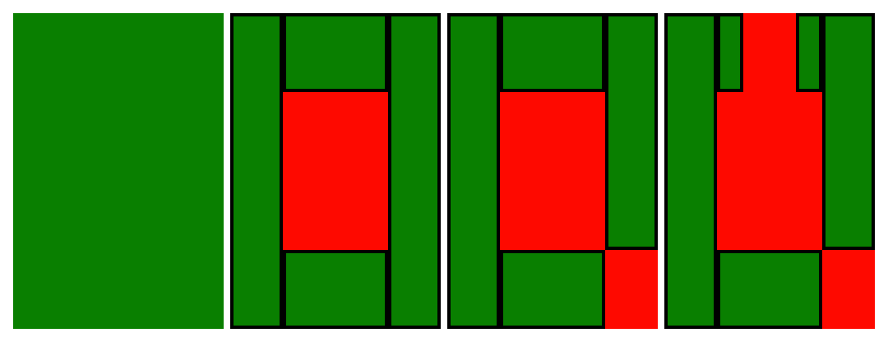

# Barren Land Analysis
## Requirements
Java is required to run the analysis.  
Maven is required for testing and building.  
## Testing
Execute  
```
mvn test
```  
## Building
Execute  
```
mvn compile
```  
Then inspect the target/classes folder for `Application`
## Running
Execute
```
cd target/classes
java Application
```
For example:
```
$ cd target/classes
$ java Application
{"0 292 399 307"}
116800 116800
$ echo '{"48 192 351 207", "48 392 351 407", "120 52 135 547", "260 52 275 547"}' | java Application
22816 192608
```
## Notes
### Overview
This documentation assumes your familiarity with the objective. The overview portion gives a brief description
of the approach included in this project. The headings below provide extra insight into specific parts of the solution.  
The entry point for this solution is in `Application`. `Application` is responsible for validating and structuring
the input data as well as formatting output.  
`Application` passes the input data to `SubtractionSolver` and in response expects a
list of areas in square meters in ascending order. `SubtractionSolver` passes the barren rectangles along with the
initial all-encompassing plot to the `subtractAll` method. This method
iteratively subtracts barren plots from remaining arable plots. Each iteration singles out a barren rectangle and finds
overlapping arable rectangles. Barren-overlapping arable rectangles are broken into smaller rectangles that do not overlap
the barren rectangle while the remaining barren rectangles are passed back into `subtractAll` until no barren rectangles
are left.  
When subtraction is complete, `SubtractionSolver` is left with a collection of rectangles that do not overlap any
barren rectangles. Since groups of adjacent rectangles are considered one "area" of arable land, `SubtractionSolver`
uses a graph where edges represent rectangle adjacency to group arable rectangles. The `Graph` class is responsible
for representing these relationships as well as finding all distinct disconnected subgraphs. The disconnected subgraphs
are given back to `SubtractionSolver` when each subgraph is reduced their square meter areas and returned back to
`Application`.  
### Cells vs. Boundaries
Working with shapes in a grid presents an important question:
should shapes' dimensions be expressed using the absolute edge of the shape
or by using the center of edge cells of the shape?
  
Consider the following:
* This solution performs arithmetic using the length of rectangle sides.  
* This solution checks if rectangles share edges.  

For these reasons, the program internally represents rectangles using absolute boundaries (see the `Rectangle` class).
However, the input for the program is expressed using cell center locations; when input is passed into the
barren land solver, the boundary notation is implicitly converted from cell to boundary. 
### Breaking the Problem Down: Subtraction and Recursion 
When more than one rectangle of barren land is presented, it becomes more difficult
to find the area of arable land. Because of this simple observation, this solution reduces
the problem to solving for one rectangle of barren land at a time. When a new rectangle of barren land
is to be considered, all overlapping rectangles of arable land are found. The barren land is then
subtracted from each overlapping rectangle while the result is broken into a number of smaller rectangles.
This process is repeated recursively until all barren land has been considered.  


Green areas are arable land. Red areas are barren land. Each frame adds a new barren rectangle.
### Reducing the Constituent Arable Rectangles
By the time all barren land has been considered, there exists a set of rectangles that describe all
remaining arable land. Sometimes groups of arable land exist disconnected from other groups. The output
is required to list the area of each of these groups. To model these groups in the program, a graph is built
representing all the rectangles and their adjacencies to each other. By initially treating each rectangle as an
independent subgraph, the program can iteratively merge all subgraphs into their distinct connected parent graphs.
After that, there is a simple operation mapping each parent graph to the total area of its constituent arable rectangles.